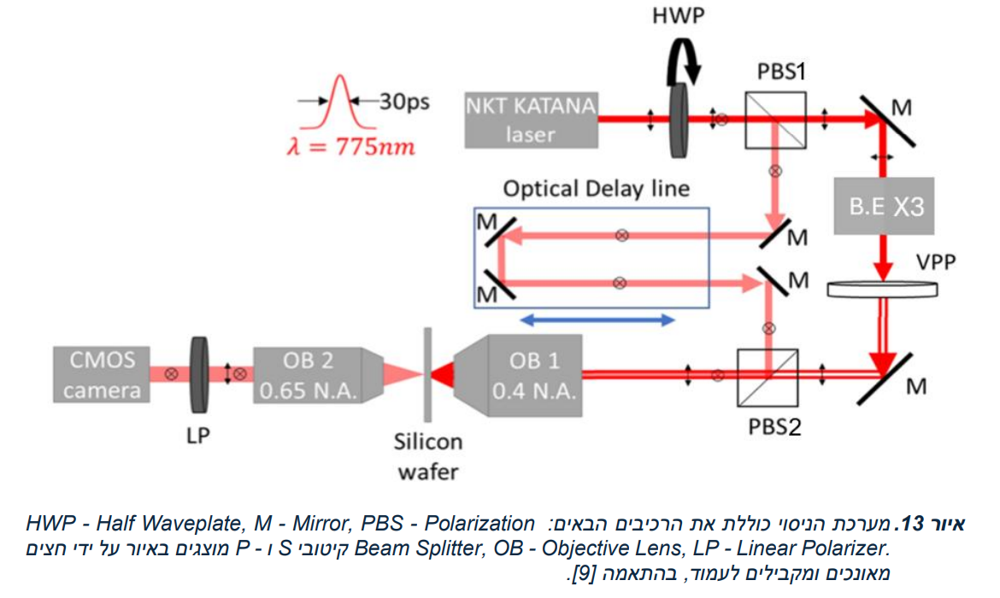
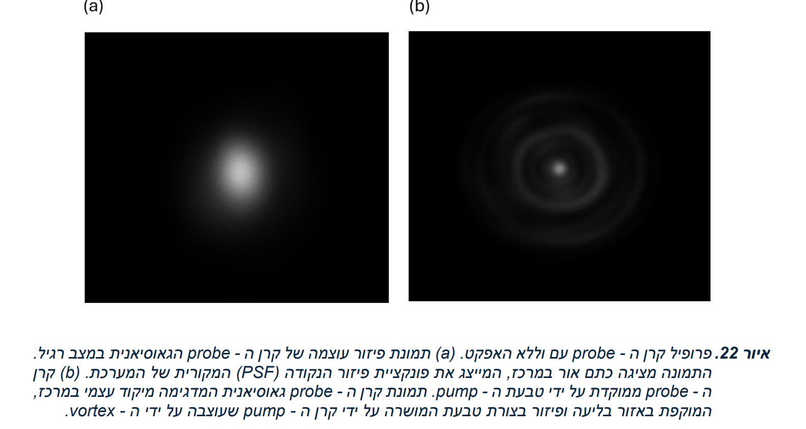
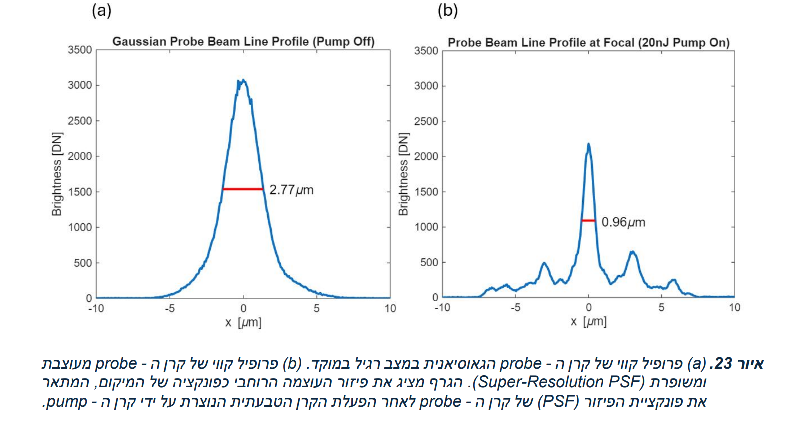
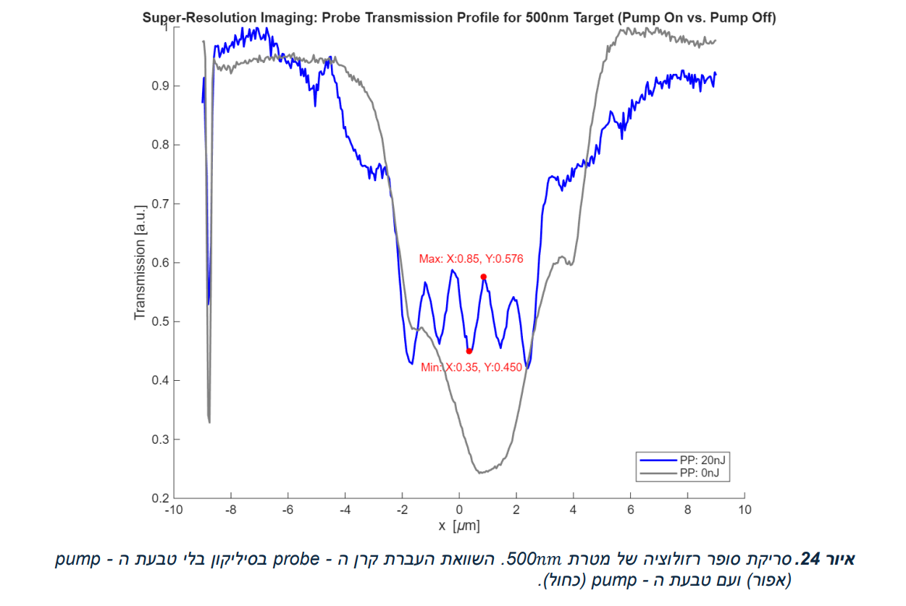
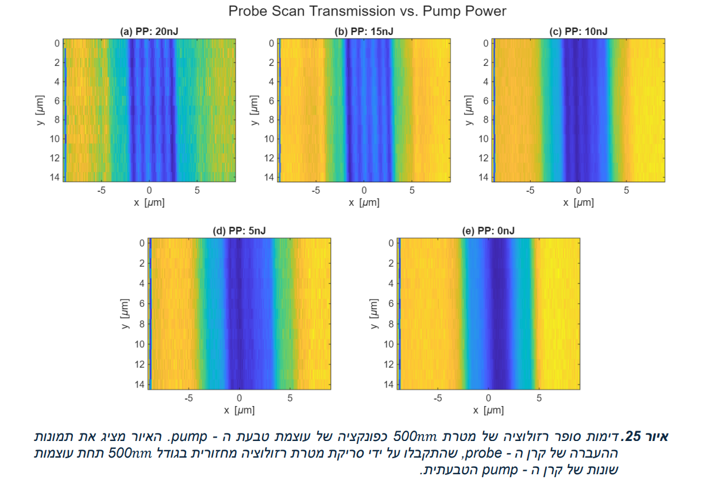

# M.Sc. Thesis: Achieving Super-Resolution Imaging in Silicon

**Author:** Asaf Malran  
**Institution:** Faculty of Engineering, Bar-Ilan University  

## Abstract
In optical microscopy, resolution is fundamentally limited by the Abbe diffraction limit, defined as half the wavelength divided by the numerical aperture. This limitation poses a significant challenge in Laser Scanning Microscopy (LSM), a standard and critical tool for failure analysis and defect detection in the semiconductor industry. However, as component dimensions in integrated circuits continue to shrink, the diffraction limit prevents resolving nanometric details and detecting tiny defects.

This research demonstrates a novel method for achieving super-resolution imaging in silicon by creating a temporary lens deep within the material. This technique overcomes the limitations of conventional LSM by sharpening the scanning laser spot below the diffraction limit. 

The lens is generated using a ring-shaped "pump" laser beam, which is absorbed in the silicon and generates a spatial distribution of free charge carriers matching the beam profile. This is based on the **Plasma Dispersion Effect (PDE)** principle, which states that a change in carrier distribution modifies the material's refractive index. 

We generate the ring shape of the pump beam using a Vortex Phase Plate (VPP). This creates a ring-shaped carrier profile, resulting in the formation of a GRIN (Gradient Index) Lens-like structure through the modification of the refractive index and rapid diffusion of free charge carriers. This temporary lens focuses the probe beam to a spot size smaller than the diffraction limit.

## Key Contributions & Results
* **Super-Resolution Integration:** Extended previous setups by optimally integrating a **Beam Expander** into the system, enabling precise control over the pump beam's ring diameter and the creation of a sharper GRIN lens.
* **Twofold Resolution Improvement:** Achieved high-quality imaging by scanning a resolution target consisting of 5 gold bars with a width of 0.5µm and a spacing of 0.5µm. This constitutes a twofold improvement (2x) in resolution compared to previous work at the 775nm wavelength.
* **Non-Destructive Testing:** Demonstrated the potential for applications in semiconductor inspection without direct contact with the imaging medium.

## Repository Contents
* `Asaf_Malran_MSc_Thesis.pdf`: The full Master's Thesis document (Hebrew with English Abstract).
* `xy_scan_Power_Basler.m`: MATLAB script used for controlling the experimental setup and performing the scanning of the resolution targets (Data Acquisition).
* `analysis_xy_scan.m`: MATLAB script used for analyzing the scanned results and extracting the contrast profiles (Data Analysis).

## Experimental Setup and Results

### 1. The Optical System
Schematic diagram of the developed experimental setup.

### 2. Probe Beam Sharpening (The PDE Effect)
Comparison of the probe beam profile without the pump beam (left) and focused by the donut-shaped pump beam (right).

Cross-section line profile showing the reduction of the focal spot size from 2.77µm to 0.96µm.

### 3. Super-Resolution Scanning of a 500nm Target
1D transmission profile comparing the scan with the pump off (gray) and pump on (blue), demonstrating the resolution of 500nm features.

2D imaging results of the 500nm resolution target as a function of the pump beam energy.

